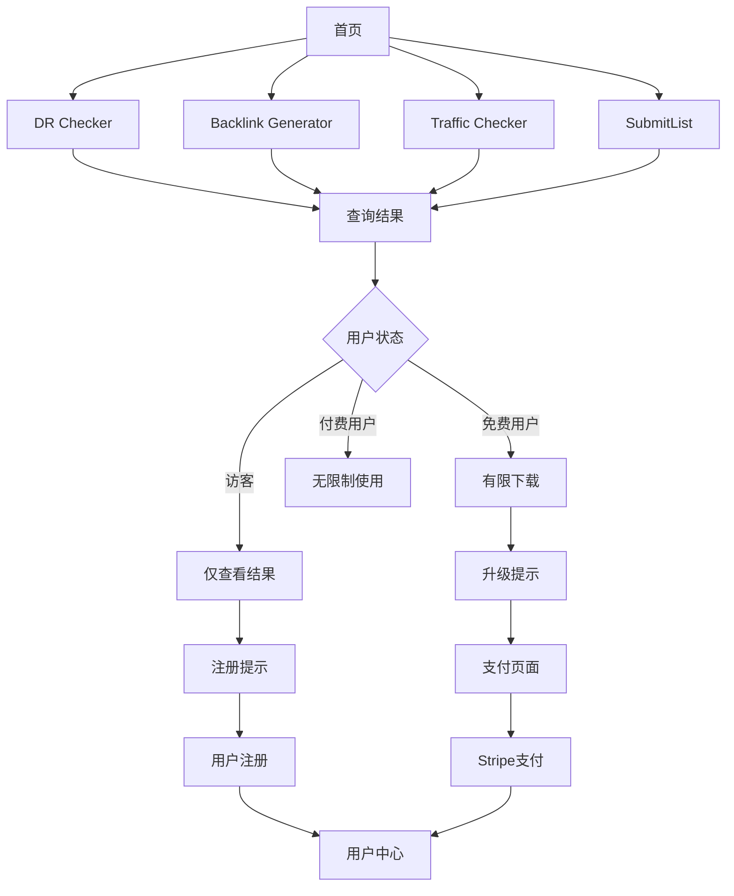

# BacklinksBuilder 产品需求文档

## 1. 产品概述

BacklinksBuilder 是一个专业的SEO工具平台，为用户提供域名评级检查、流量分析、反链生成和提交列表等核心功能。
该产品旨在帮助SEO专业人士、营销人员和网站所有者提升网站排名和流量，通过数据驱动的方式优化SEO策略。
产品采用SaaS模式，提供免费试用和多层级付费订阅服务，目标成为SEO工具市场的领先解决方案。

## 2. 核心功能

### 2.1 用户角色

| 角色 | 注册方式 | 核心权限 |
|------|----------|----------|
| 访客用户 | 无需注册 | 可查询但不能下载结果 |
| 免费用户 | 邮箱注册 | 有限次数查询和下载：10次DR检查、10次流量检查、10次反链检查、50个反链查看 |
| Pro用户 | 付费升级 | 1000次各类检查、所有反链查看(200+)、数据导出功能 |
| SuperPro用户 | 付费升级 | 5000次各类检查、所有反链查看(200+)、优先支持、早期功能访问 |

### 2.2 功能模块

我们的BacklinksBuilder平台包含以下主要页面：
1. **首页**: 产品介绍、功能展示、定价方案
2. **SubmitList页面**: 网站提交列表管理和批量提交功能
3. **DR Checker页面**: 域名评级批量查询和分析工具
4. **Backlink Generator页面**: 反链生成和分析工具
5. **Traffic Checker页面**: 网站流量分析和监控工具
6. **用户中心**: 账户管理、使用统计、订阅管理
7. **支付页面**: Stripe集成的订阅和支付管理

### 2.3 页面详情

| 页面名称 | 模块名称 | 功能描述 |
|----------|----------|----------|
| 首页 | Hero区域 | 产品介绍、核心价值展示、CTA按钮 |
| 首页 | 功能展示 | 四大核心工具的功能介绍和预览 |
| 首页 | 定价方案 | 免费、Pro、SuperPro三个套餐的对比展示 |
| DR Checker | 批量输入 | 支持域名批量输入，最多100个域名 |
| DR Checker | 查询处理 | 调用API获取域名评级(0-100)和全球排名数据 |
| DR Checker | 结果展示 | 表格形式展示查询结果，支持排序和筛选 |
| DR Checker | 数据导出 | 支持CSV/Excel格式导出(需登录用户权限) |
| Backlink Generator | 域名分析 | 输入目标域名，分析现有反链结构 |
| Backlink Generator | 机会发现 | 基于竞争对手分析，发现潜在反链机会 |
| Backlink Generator | 结果管理 | 反链机会列表管理和状态跟踪 |
| Traffic Checker | 流量查询 | 批量查询网站流量数据和趋势分析 |
| Traffic Checker | 竞争分析 | 对比分析多个网站的流量表现 |
| Traffic Checker | 报告生成 | 生成详细的流量分析报告 |
| SubmitList | 目录管理 | 管理和维护网站提交目录列表 |
| SubmitList | 批量提交 | 一键批量提交网站到多个目录 |
| SubmitList | 状态跟踪 | 跟踪提交状态和结果反馈 |
| 用户中心 | 账户信息 | 用户基本信息管理和密码修改 |
| 用户中心 | 使用统计 | 各功能使用次数统计和剩余配额显示 |
| 用户中心 | 订阅管理 | 当前订阅状态、升级/降级、取消订阅 |
| 支付页面 | 套餐选择 | Pro和SuperPro套餐的月付/年付选择 |
| 支付页面 | Stripe集成 | 安全的信用卡支付处理 |
| 支付页面 | 订单确认 | 支付成功确认和订阅激活 |

## 3. 核心流程

### 访客用户流程
用户访问首页 → 选择工具(如DR Checker) → 输入查询数据 → 查看结果(无下载权限) → 提示注册获取更多功能

### 注册用户流程
用户注册/登录 → 选择工具 → 输入查询数据 → 查看结果 → 下载数据(受次数限制) → 查看剩余配额 → 升级提示

### 付费用户流程
付费用户登录 → 选择工具 → 批量输入数据 → 获取详细结果 → 无限制下载 → 高级功能访问

### 支付流程
用户选择升级 → 选择套餐(Pro/SuperPro) → 选择付费周期(月付/年付) → Stripe支付 → 账户升级 → 功能解锁

## 4. 用户界面设计

### 4.1 设计风格
- **主色调**: 蓝色系(#0b8aff)作为主色，白色和灰色作为辅助色
- **按钮样式**: 圆角按钮设计，支持hover和focus状态
- **字体**: Inter字体系列，标题使用medium权重，正文使用regular权重
- **布局风格**: 卡片式布局，顶部导航栏，响应式设计
- **图标风格**: 使用Tabler Icons，线性风格，保持一致性

### 4.2 页面设计概览

| 页面名称 | 模块名称 | UI元素 |
|----------|----------|--------|
| DR Checker | 输入区域 | 大型文本框，支持批量输入，蓝色边框，placeholder提示 |
| DR Checker | 控制面板 | 查询按钮(蓝色背景)，清空按钮(灰色边框)，导出按钮(绿色) |
| DR Checker | 结果表格 | 白色背景，斑马纹行，可排序表头，分页控件 |
| DR Checker | 状态指示 | 加载动画，进度条，成功/错误状态提示 |
| 用户中心 | 导航标签 | 水平标签导航，激活状态蓝色下划线 |
| 用户中心 | 统计卡片 | 白色卡片，圆角阴影，数字突出显示 |
| 支付页面 | 套餐卡片 | 渐变背景，Pro(深色)，SuperPro(蓝色)，价格突出 |
| 支付页面 | Stripe表单 | 白色背景，圆角输入框，安全标识 |

### 4.3 响应式设计
产品采用移动优先的响应式设计，支持桌面端、平板和手机端访问，针对触摸交互进行优化，确保在所有设备上的良好用户体验。