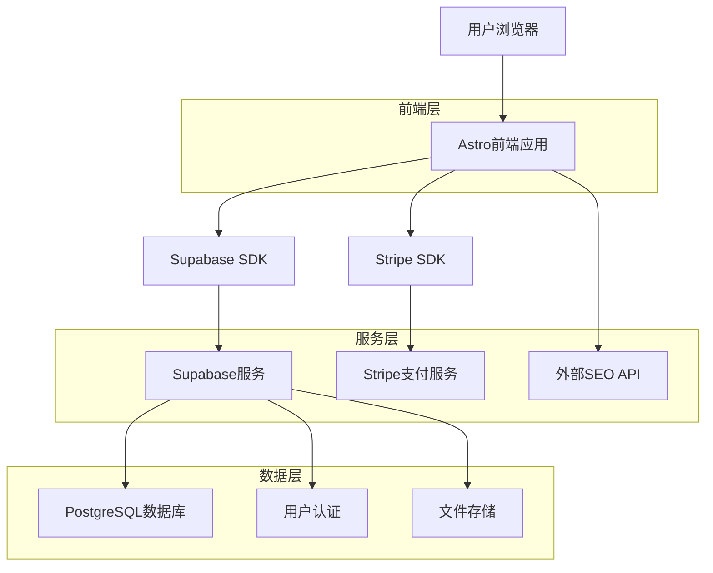
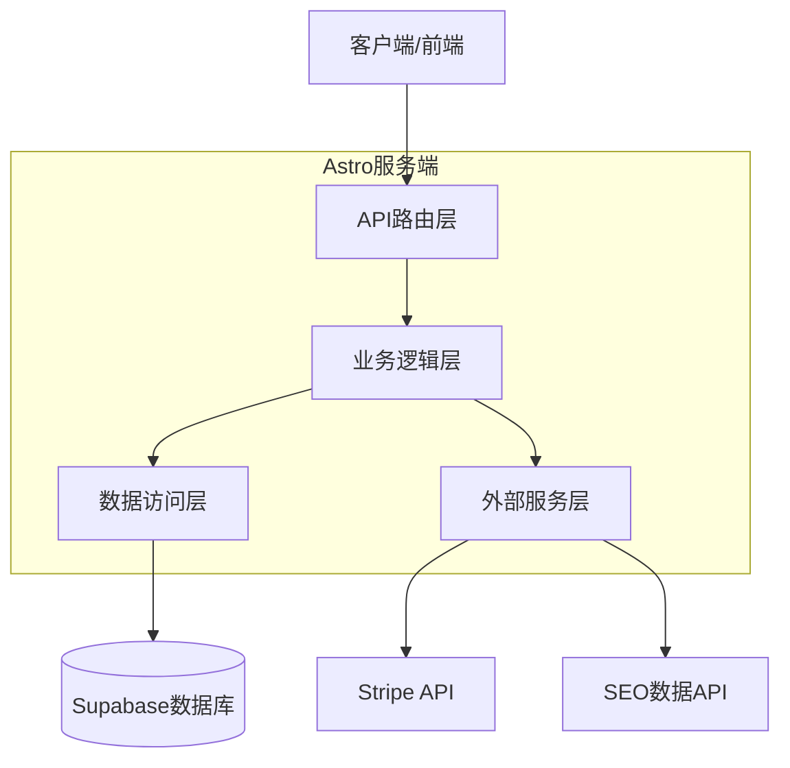
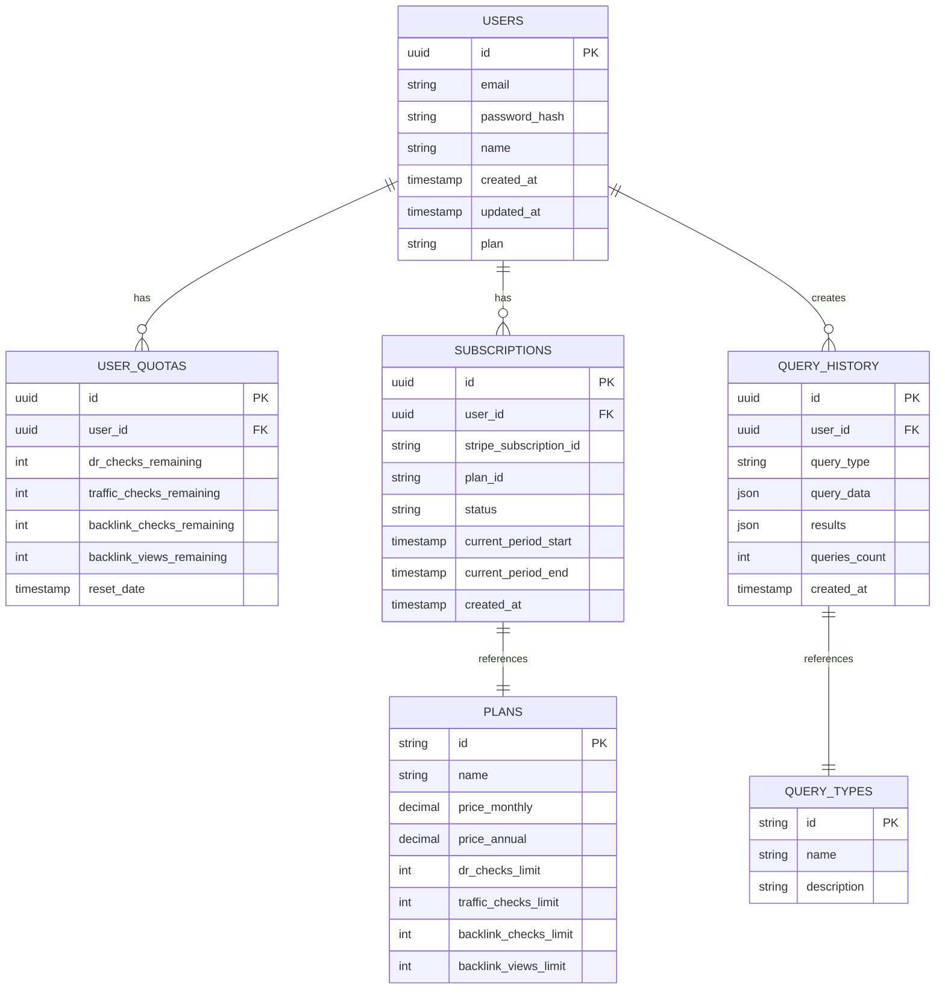

# BacklinksBuilder 技术架构文档

## 1. 架构设计



## 2. 技术描述

- **前端**: Astro@5 + TailwindCSS@4 + Alpine.js + TypeScript
- **后端**: Supabase (PostgreSQL + 认证 + 存储)
- **支付**: Stripe SDK
- **外部API**: SEO数据提供商API (Ahrefs/SEMrush/Moz)
- **部署**: Vercel/Netlify

## 3. 路由定义

| 路由 | 用途 |
|------|------|
| / | 首页，展示产品介绍和主要功能导航 |
| /submit-list | 网站提交列表管理页面 |
| /backlink-generator | 反链生成工具页面 |
| /dr-checker | 域名评级检查工具页面 |
| /traffic-checker | 流量检查工具页面 |
| /auth/login | 用户登录页面 |
| /auth/register | 用户注册页面 |
| /auth/callback | OAuth回调处理页面 |
| /dashboard | 用户中心仪表板 |
| /dashboard/usage | 使用统计页面 |
| /dashboard/subscription | 订阅管理页面 |
| /pricing | 定价页面 |
| /payment/checkout | Stripe支付页面 |
| /payment/success | 支付成功页面 |
| /payment/cancel | 支付取消页面 |

## 4. API定义

### 4.1 核心API

**用户认证相关**
```
POST /api/auth/login
```

请求参数:
| 参数名 | 参数类型 | 是否必需 | 描述 |
|--------|----------|----------|------|
| email | string | true | 用户邮箱 |
| password | string | true | 用户密码 |

响应参数:
| 参数名 | 参数类型 | 描述 |
|--------|----------|------|
| success | boolean | 登录是否成功 |
| user | object | 用户信息对象 |
| session | object | 会话信息 |

**DR检查API**
```
POST /api/tools/dr-check
```

请求参数:
| 参数名 | 参数类型 | 是否必需 | 描述 |
|--------|----------|----------|------|
| domains | string[] | true | 域名列表，最多100个 |
| user_id | string | false | 用户ID(用于计费) |

响应参数:
| 参数名 | 参数类型 | 描述 |
|--------|----------|------|
| results | object[] | 查询结果数组 |
| total_queries | number | 本次查询数量 |
| remaining_quota | number | 剩余配额 |

示例:
```json
{
  "domains": ["example.com", "test.com"],
  "user_id": "uuid-string"
}
```

**用户配额检查**
```
GET /api/user/quota
```

响应参数:
| 参数名 | 参数类型 | 描述 |
|--------|----------|------|
| dr_checks | number | DR检查剩余次数 |
| traffic_checks | number | 流量检查剩余次数 |
| backlink_checks | number | 反链检查剩余次数 |
| backlink_views | number | 反链查看剩余次数 |
| plan | string | 当前订阅计划 |

**Stripe支付处理**
```
POST /api/payment/create-checkout
```

请求参数:
| 参数名 | 参数类型 | 是否必需 | 描述 |
|--------|----------|----------|------|
| plan | string | true | 订阅计划(pro/super) |
| billing_cycle | string | true | 计费周期(monthly/annual) |
| user_id | string | true | 用户ID |

## 5. 服务器架构图



## 6. 数据模型

### 6.1 数据模型定义



### 6.2 数据定义语言

**用户表 (users)**
```sql
-- 创建用户表
CREATE TABLE users (
    id UUID PRIMARY KEY DEFAULT gen_random_uuid(),
    email VARCHAR(255) UNIQUE NOT NULL,
    password_hash VARCHAR(255),
    name VARCHAR(100),
    plan VARCHAR(20) DEFAULT 'free' CHECK (plan IN ('free', 'pro', 'super')),
    created_at TIMESTAMP WITH TIME ZONE DEFAULT NOW(),
    updated_at TIMESTAMP WITH TIME ZONE DEFAULT NOW()
);

-- 创建索引
CREATE INDEX idx_users_email ON users(email);
CREATE INDEX idx_users_plan ON users(plan);

-- 启用RLS
ALTER TABLE users ENABLE ROW LEVEL SECURITY;

-- 创建RLS策略
CREATE POLICY "Users can view own profile" ON users
    FOR SELECT USING (auth.uid() = id);

CREATE POLICY "Users can update own profile" ON users
    FOR UPDATE USING (auth.uid() = id);

-- 授权
GRANT SELECT ON users TO anon;
GRANT ALL PRIVILEGES ON users TO authenticated;
```

**用户配额表 (user_quotas)**
```sql
-- 创建用户配额表
CREATE TABLE user_quotas (
    id UUID PRIMARY KEY DEFAULT gen_random_uuid(),
    user_id UUID REFERENCES users(id) ON DELETE CASCADE,
    dr_checks_remaining INTEGER DEFAULT 10,
    traffic_checks_remaining INTEGER DEFAULT 10,
    backlink_checks_remaining INTEGER DEFAULT 10,
    backlink_views_remaining INTEGER DEFAULT 50,
    reset_date TIMESTAMP WITH TIME ZONE DEFAULT (NOW() + INTERVAL '1 month'),
    created_at TIMESTAMP WITH TIME ZONE DEFAULT NOW(),
    updated_at TIMESTAMP WITH TIME ZONE DEFAULT NOW()
);

-- 创建索引
CREATE INDEX idx_user_quotas_user_id ON user_quotas(user_id);
CREATE INDEX idx_user_quotas_reset_date ON user_quotas(reset_date);

-- 启用RLS
ALTER TABLE user_quotas ENABLE ROW LEVEL SECURITY;

-- 创建RLS策略
CREATE POLICY "Users can view own quotas" ON user_quotas
    FOR SELECT USING (auth.uid() = user_id);

CREATE POLICY "Users can update own quotas" ON user_quotas
    FOR UPDATE USING (auth.uid() = user_id);

-- 授权
GRANT SELECT ON user_quotas TO anon;
GRANT ALL PRIVILEGES ON user_quotas TO authenticated;
```

**订阅表 (subscriptions)**
```sql
-- 创建订阅表
CREATE TABLE subscriptions (
    id UUID PRIMARY KEY DEFAULT gen_random_uuid(),
    user_id UUID REFERENCES users(id) ON DELETE CASCADE,
    stripe_subscription_id VARCHAR(255) UNIQUE,
    plan_id VARCHAR(50) NOT NULL,
    status VARCHAR(50) DEFAULT 'active',
    current_period_start TIMESTAMP WITH TIME ZONE,
    current_period_end TIMESTAMP WITH TIME ZONE,
    created_at TIMESTAMP WITH TIME ZONE DEFAULT NOW(),
    updated_at TIMESTAMP WITH TIME ZONE DEFAULT NOW()
);

-- 创建索引
CREATE INDEX idx_subscriptions_user_id ON subscriptions(user_id);
CREATE INDEX idx_subscriptions_stripe_id ON subscriptions(stripe_subscription_id);
CREATE INDEX idx_subscriptions_status ON subscriptions(status);

-- 启用RLS
ALTER TABLE subscriptions ENABLE ROW LEVEL SECURITY;

-- 授权
GRANT SELECT ON subscriptions TO anon;
GRANT ALL PRIVILEGES ON subscriptions TO authenticated;
```

**查询历史表 (query_history)**
```sql
-- 创建查询历史表
CREATE TABLE query_history (
    id UUID PRIMARY KEY DEFAULT gen_random_uuid(),
    user_id UUID REFERENCES users(id) ON DELETE CASCADE,
    query_type VARCHAR(50) NOT NULL,
    query_data JSONB NOT NULL,
    results JSONB,
    queries_count INTEGER DEFAULT 1,
    created_at TIMESTAMP WITH TIME ZONE DEFAULT NOW()
);

-- 创建索引
CREATE INDEX idx_query_history_user_id ON query_history(user_id);
CREATE INDEX idx_query_history_type ON query_history(query_type);
CREATE INDEX idx_query_history_created_at ON query_history(created_at DESC);

-- 启用RLS
ALTER TABLE query_history ENABLE ROW LEVEL SECURITY;

-- 授权
GRANT SELECT ON query_history TO anon;
GRANT ALL PRIVILEGES ON query_history TO authenticated;

-- 初始化数据
INSERT INTO query_history (user_id, query_type, query_data, results, queries_count)
VALUES 
('00000000-0000-0000-0000-000000000000', 'dr_check', '{"domains": ["example.com"]}', '{"example.com": {"dr": 85, "rank": 1500}}', 1);
```