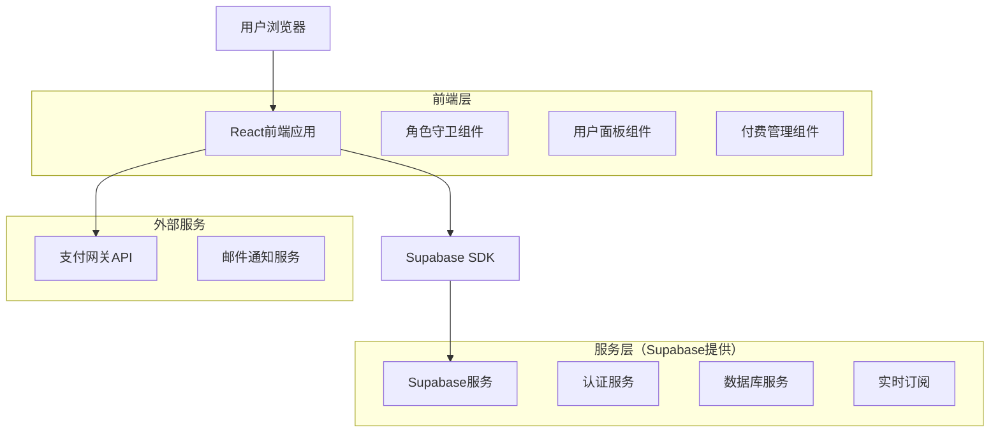
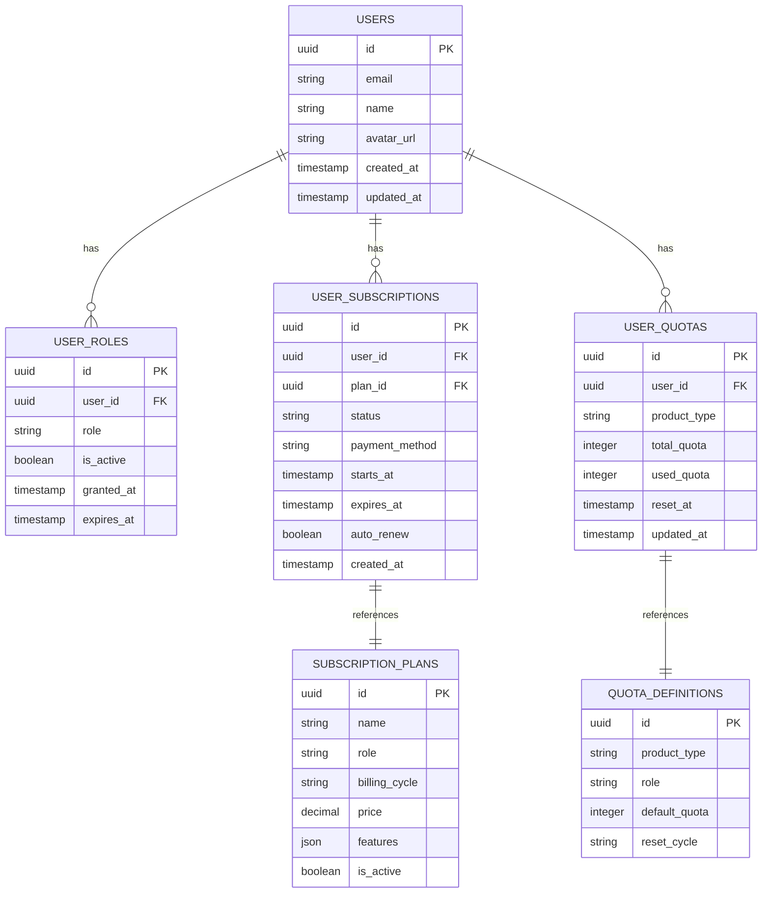

# 增强用户角色系统技术架构文档

## 1. 架构设计



## 2. 技术描述

- 前端：React@18 + TypeScript + TailwindCSS@3 + Astro
- 后端：Supabase（PostgreSQL + 认证 + 实时功能）
- 支付：Stripe/支付宝集成
- 部署：Vercel

## 3. 路由定义

| 路由 | 用途 |
|------|------|
| /dashboard | 用户面板主页，根据角色重定向到对应面板 |
| /user/dashboard | 普通用户面板（user角色） |
| /pro/dashboard | Pro会员面板（pro角色） |
| /super/dashboard | Super会员面板（super角色） |
| /admin/dashboard | 管理员面板（admin角色） |
| /admin/users | 用户管理页面 |
| /admin/roles | 角色权限管理页面 |
| /payment/subscribe | 订阅付费页面 |
| /payment/manage | 付费管理页面 |
| /profile/settings | 个人设置页面 |

## 4. API定义

### 4.1 核心API

#### 用户角色相关

```
GET /api/auth/get-user-role
```

请求参数：
| 参数名 | 参数类型 | 是否必需 | 描述 |
|--------|----------|----------|------|
| userId | string | true | 用户ID |

响应：
| 参数名 | 参数类型 | 描述 |
|--------|----------|------|
| role | string | 用户角色（free/user/pro/super/admin） |
| subscription | object | 订阅信息 |
| quotas | object | 额度信息 |

示例：
```json
{
  "role": "pro",
  "subscription": {
    "type": "monthly",
    "status": "active",
    "expires_at": "2024-02-15T00:00:00Z"
  },
  "quotas": {
    "backlink_generation": {
      "total": 1000,
      "used": 250,
      "remaining": 750
    }
  }
}
```

#### 订阅管理相关

```
POST /api/payment/create-subscription
```

请求参数：
| 参数名 | 参数类型 | 是否必需 | 描述 |
|--------|----------|----------|------|
| plan | string | true | 订阅计划（pro_monthly/pro_yearly/super_monthly/super_yearly） |
| payment_method | string | true | 支付方式 |

```
PUT /api/payment/update-subscription
```

请求参数：
| 参数名 | 参数类型 | 是否必需 | 描述 |
|--------|----------|----------|------|
| subscription_id | string | true | 订阅ID |
| action | string | true | 操作类型（upgrade/downgrade/cancel） |

#### 额度管理相关

```
GET /api/quotas/usage
```

响应：
| 参数名 | 参数类型 | 描述 |
|--------|----------|------|
| quotas | object | 各产品额度使用情况 |
| usage_history | array | 使用历史记录 |

```
POST /api/quotas/consume
```

请求参数：
| 参数名 | 参数类型 | 是否必需 | 描述 |
|--------|----------|----------|------|
| product | string | true | 产品类型 |
| amount | number | true | 消耗数量 |

## 5. 数据模型

### 5.1 数据模型定义



### 5.2 数据定义语言

#### 用户角色表（user_roles）
```sql
-- 创建用户角色表
CREATE TABLE user_roles (
    id UUID PRIMARY KEY DEFAULT gen_random_uuid(),
    user_id UUID NOT NULL REFERENCES auth.users(id) ON DELETE CASCADE,
    role VARCHAR(20) NOT NULL CHECK (role IN ('free', 'user', 'pro', 'super', 'admin')),
    is_active BOOLEAN DEFAULT true,
    granted_at TIMESTAMP WITH TIME ZONE DEFAULT NOW(),
    expires_at TIMESTAMP WITH TIME ZONE,
    created_at TIMESTAMP WITH TIME ZONE DEFAULT NOW(),
    updated_at TIMESTAMP WITH TIME ZONE DEFAULT NOW()
);

-- 创建索引
CREATE INDEX idx_user_roles_user_id ON user_roles(user_id);
CREATE INDEX idx_user_roles_role ON user_roles(role);
CREATE UNIQUE INDEX idx_user_roles_active_unique ON user_roles(user_id) WHERE is_active = true;
```

#### 订阅计划表（subscription_plans）
```sql
-- 创建订阅计划表
CREATE TABLE subscription_plans (
    id UUID PRIMARY KEY DEFAULT gen_random_uuid(),
    name VARCHAR(100) NOT NULL,
    role VARCHAR(20) NOT NULL CHECK (role IN ('pro', 'super')),
    billing_cycle VARCHAR(20) NOT NULL CHECK (billing_cycle IN ('monthly', 'yearly')),
    price DECIMAL(10,2) NOT NULL,
    features JSONB NOT NULL DEFAULT '{}',
    is_active BOOLEAN DEFAULT true,
    created_at TIMESTAMP WITH TIME ZONE DEFAULT NOW()
);

-- 插入初始数据
INSERT INTO subscription_plans (name, role, billing_cycle, price, features) VALUES
('Pro月费会员', 'pro', 'monthly', 29.99, '{"backlink_quota": 1000, "dr_checks": 500, "priority_support": true}'),
('Pro年费会员', 'pro', 'yearly', 299.99, '{"backlink_quota": 12000, "dr_checks": 6000, "priority_support": true, "discount": "2个月免费"}'),
('Super月费会员', 'super', 'monthly', 99.99, '{"backlink_quota": "unlimited", "dr_checks": "unlimited", "priority_support": true, "dedicated_support": true}'),
('Super年费会员', 'super', 'yearly', 999.99, '{"backlink_quota": "unlimited", "dr_checks": "unlimited", "priority_support": true, "dedicated_support": true, "discount": "2个月免费"}');
```

#### 用户订阅表（user_subscriptions）
```sql
-- 创建用户订阅表
CREATE TABLE user_subscriptions (
    id UUID PRIMARY KEY DEFAULT gen_random_uuid(),
    user_id UUID NOT NULL REFERENCES auth.users(id) ON DELETE CASCADE,
    plan_id UUID NOT NULL REFERENCES subscription_plans(id),
    status VARCHAR(20) NOT NULL DEFAULT 'active' CHECK (status IN ('active', 'cancelled', 'expired', 'pending')),
    payment_method VARCHAR(50),
    stripe_subscription_id VARCHAR(255),
    starts_at TIMESTAMP WITH TIME ZONE DEFAULT NOW(),
    expires_at TIMESTAMP WITH TIME ZONE NOT NULL,
    auto_renew BOOLEAN DEFAULT true,
    created_at TIMESTAMP WITH TIME ZONE DEFAULT NOW(),
    updated_at TIMESTAMP WITH TIME ZONE DEFAULT NOW()
);

-- 创建索引
CREATE INDEX idx_user_subscriptions_user_id ON user_subscriptions(user_id);
CREATE INDEX idx_user_subscriptions_status ON user_subscriptions(status);
CREATE INDEX idx_user_subscriptions_expires_at ON user_subscriptions(expires_at);
```

#### 用户额度表（user_quotas）
```sql
-- 创建用户额度表
CREATE TABLE user_quotas (
    id UUID PRIMARY KEY DEFAULT gen_random_uuid(),
    user_id UUID NOT NULL REFERENCES auth.users(id) ON DELETE CASCADE,
    product_type VARCHAR(50) NOT NULL,
    total_quota INTEGER NOT NULL DEFAULT 0,
    used_quota INTEGER NOT NULL DEFAULT 0,
    reset_at TIMESTAMP WITH TIME ZONE,
    created_at TIMESTAMP WITH TIME ZONE DEFAULT NOW(),
    updated_at TIMESTAMP WITH TIME ZONE DEFAULT NOW()
);

-- 创建索引
CREATE INDEX idx_user_quotas_user_id ON user_quotas(user_id);
CREATE INDEX idx_user_quotas_product_type ON user_quotas(product_type);
CREATE UNIQUE INDEX idx_user_quotas_user_product ON user_quotas(user_id, product_type);
```

#### 额度定义表（quota_definitions）
```sql
-- 创建额度定义表
CREATE TABLE quota_definitions (
    id UUID PRIMARY KEY DEFAULT gen_random_uuid(),
    product_type VARCHAR(50) NOT NULL,
    role VARCHAR(20) NOT NULL CHECK (role IN ('free', 'user', 'pro', 'super', 'admin')),
    default_quota INTEGER NOT NULL,
    reset_cycle VARCHAR(20) NOT NULL CHECK (reset_cycle IN ('daily', 'monthly', 'yearly', 'never')),
    created_at TIMESTAMP WITH TIME ZONE DEFAULT NOW()
);

-- 插入初始数据
INSERT INTO quota_definitions (product_type, role, default_quota, reset_cycle) VALUES
('backlink_generation', 'free', 5, 'daily'),
('backlink_generation', 'user', 50, 'monthly'),
('backlink_generation', 'pro', 1000, 'monthly'),
('backlink_generation', 'super', -1, 'never'),
('dr_checker', 'free', 3, 'daily'),
('dr_checker', 'user', 30, 'monthly'),
('dr_checker', 'pro', 500, 'monthly'),
('dr_checker', 'super', -1, 'never'),
('traffic_checker', 'free', 2, 'daily'),
('traffic_checker', 'user', 20, 'monthly'),
('traffic_checker', 'pro', 200, 'monthly'),
('traffic_checker', 'super', -1, 'never');

-- 创建索引
CREATE INDEX idx_quota_definitions_role ON quota_definitions(role);
CREATE INDEX idx_quota_definitions_product_type ON quota_definitions(product_type);
CREATE UNIQUE INDEX idx_quota_definitions_product_role ON quota_definitions(product_type, role);
```

#### 权限设置
```sql
-- 设置表权限
GRANT SELECT ON user_roles TO anon;
GRANT ALL PRIVILEGES ON user_roles TO authenticated;

GRANT SELECT ON subscription_plans TO anon;
GRANT ALL PRIVILEGES ON subscription_plans TO authenticated;

GRANT SELECT ON user_subscriptions TO anon;
GRANT ALL PRIVILEGES ON user_subscriptions TO authenticated;

GRANT SELECT ON user_quotas TO anon;
GRANT ALL PRIVILEGES ON user_quotas TO authenticated;

GRANT SELECT ON quota_definitions TO anon;
GRANT ALL PRIVILEGES ON quota_definitions TO authenticated;
```