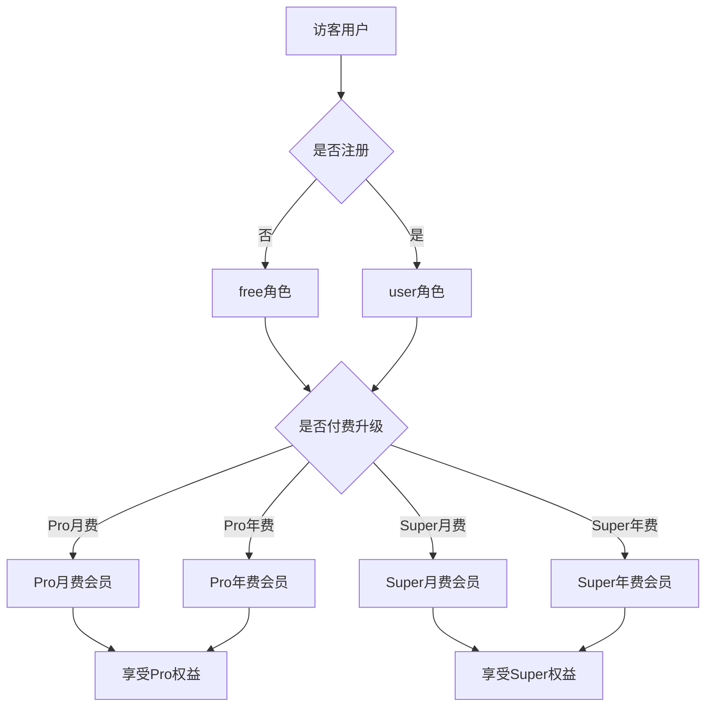
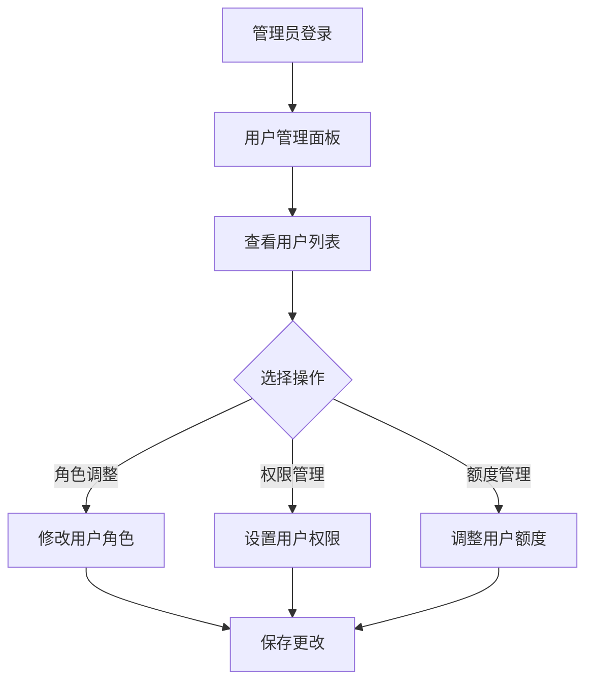

# 增强用户角色系统产品需求文档

## 1. 产品概述

本文档定义了BacklinksBuilder平台的增强用户角色系统，支持五种不同的用户角色，为不同层级的用户提供差异化的功能和服务体验。

系统旨在通过精细化的角色管理和付费模式，提升用户体验并实现商业价值最大化。

## 2. 核心功能

### 2.1 用户角色

| 角色 | 注册方式 | 核心权限 | 付费状态 |
|------|----------|----------|----------|
| free | 无需注册 | 基础功能试用，有限额度 | 未付费 |
| user | 邮箱注册/OAuth登录 | 完整基础功能，标准额度 | 未付费 |
| Pro | 升级付费 | 高级功能，大额度，优先支持 | 月费/年费会员 |
| super | 升级付费 | 全功能访问，无限额度，专属服务 | 月费/年费会员 |
| admin | 系统分配 | 系统管理，用户管理，数据分析 | 管理员 |

### 2.2 功能模块

系统包含以下核心页面：

1. **用户面板页面**：个人信息展示、等级状态、额度管理、升级入口
2. **角色管理页面**：管理员专用，用户角色分配和权限管理
3. **付费管理页面**：订阅管理、付费历史、续费提醒
4. **额度监控页面**：各产品使用情况、额度统计、使用趋势

### 2.3 页面详情

| 页面名称 | 模块名称 | 功能描述 |
|----------|----------|----------|
| 用户面板 | 个人信息区 | 显示邮箱、头像、用户名，支持编辑和更新 |
| 用户面板 | 等级状态区 | 显示当前用户等级、付费类型（月费/年费）、到期时间 |
| 用户面板 | 额度统计区 | 展示各产品总额度、已使用额度、剩余额度，进度条可视化 |
| 用户面板 | 升级入口区 | 根据当前角色显示可升级选项，价格对比，优惠信息 |
| 角色管理 | 用户列表 | 显示所有用户信息，支持角色筛选和批量操作 |
| 角色管理 | 权限配置 | 设置不同角色的功能权限和额度限制 |
| 付费管理 | 订阅状态 | 显示当前订阅计划、付费周期、自动续费设置 |
| 付费管理 | 付费历史 | 展示历史付费记录、发票下载、退款申请 |
| 额度监控 | 使用统计 | 各产品使用量统计图表，支持时间范围筛选 |
| 额度监控 | 预警设置 | 额度不足预警阈值设置，邮件/站内信通知 |

## 3. 核心流程

### 用户注册和升级流程

### 管理员用户管理流程

## 4. 用户界面设计

### 4.1 设计风格

- **主色调**：蓝色系（#3B82F6）作为主色，绿色（#10B981）表示成功状态
- **辅助色**：灰色系（#6B7280）用于次要信息，橙色（#F59E0B）用于警告
- **按钮样式**：圆角设计（rounded-lg），渐变背景，悬停效果
- **字体**：Inter字体，标题16-24px，正文14-16px
- **布局风格**：卡片式布局，响应式设计，左侧导航
- **图标风格**：Heroicons线性图标，统一视觉风格

### 4.2 页面设计概览

| 页面名称 | 模块名称 | UI元素 |
|----------|----------|--------|
| 用户面板 | 个人信息区 | 圆形头像（64px），用户名（font-semibold text-xl），邮箱（text-gray-600） |
| 用户面板 | 等级状态区 | 等级徽章（bg-gradient，rounded-full），付费类型标签，到期倒计时 |
| 用户面板 | 额度统计区 | 进度条组件（bg-blue-200），使用量数字，剩余额度高亮显示 |
| 用户面板 | 升级入口区 | CTA按钮（bg-blue-600 hover:bg-blue-700），价格对比表格，优惠标签 |
| 角色管理 | 用户列表 | 表格布局，角色筛选下拉菜单，批量操作按钮组 |
| 付费管理 | 订阅状态 | 状态指示器（绿色/红色圆点），自动续费开关，升级/降级按钮 |

### 4.3 响应式设计

- **桌面优先**：主要针对桌面端设计，1200px以上最佳体验
- **移动适配**：768px以下采用堆叠布局，触摸友好的按钮尺寸
- **平板适配**：768px-1024px采用两列布局，保持功能完整性